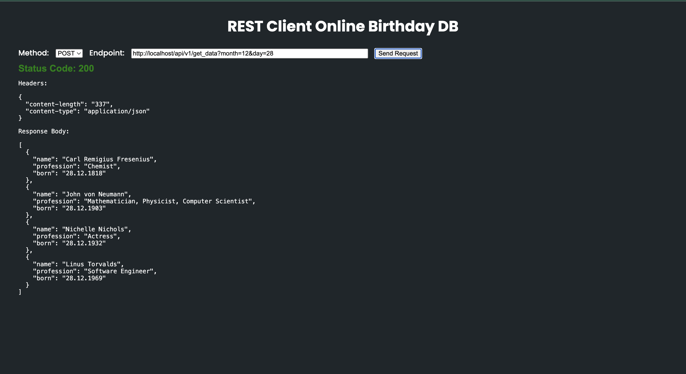
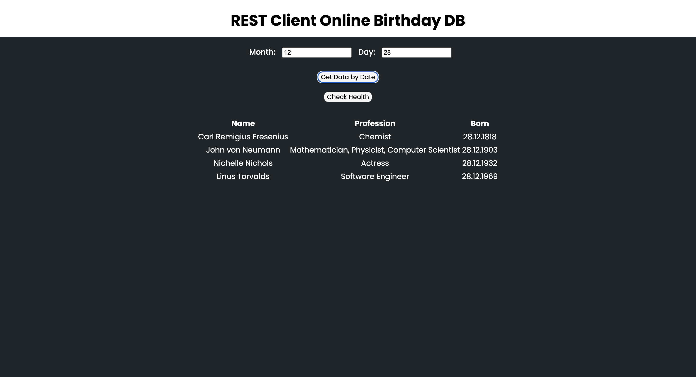

# Programmentwurf Verteilte Systeme


### Raka Pradnya Putra Adita 8778662

In diesem Projekt wird ein einfacher Geburtstags-Microservice mit Python entwickelt, der direkt auf die CouchDB-Datenbank über die HTTP-API zugreift. Der Microservice ermöglicht das Abrufen von Geburtstagsinformationen basierend auf dem Monat und dem Datum. Hierfür wird die CouchDB-Datenbank nach entsprechenden Einträgen durchsucht. Die entwickelte Lösung verwendet die Programmiersprache Python, die CouchDB HTTP-API für den direkten Datenbankzugriff und FastAPI als Framework. Neben der grundlegenden Funktionalität des Geburtstagsabrufs integriert der Microservice auch Kubernetes und Docker für eine effiziente Containerisierung und Bereitstellung in einer Clusterumgebung.

## Motivation

Ein wissenschaftlicher Blog beabsichtigt, auf seiner Startseite anzuzeigen, ob eine bedeutende Persönlichkeit aus dem Bereich Wissenschaft und Forschung heute Geburtstag hat. Hierfür nutzt der Blog einen Microservice namens "MicroAPI", um auf eine CouchDB-Datenbank zuzugreifen. Der Microservice überprüft, ob es für den aktuellen Tag Geburtstagseinträge gibt und liefert bei Treffern entsprechende Informationen zurück, die dann auf der Startseite des Blogs angezeigt werden. Dies ermöglicht den Bloglesern, auf eine unterhaltsame und informative Weise die Geburtstage herausragender Persönlichkeiten aus der Wissenschaft zu verfolgen.

## Funktionalität

Der Microservice stellt die Hauptfunktion bereit, Geburtstagsinformationen anhand des Monats und des Datums in der CouchDB-Datenbank abzurufen.

## Verwendete Technologien

1. **Python**: Die Programmiersprache, in der der Microservice entwickelt wurde.

2. **FastAPI**: Die Verwendung von FastAPI, einem modernen Web-Framework für Python, wurde ebenfalls integriert, um effiziente und schnelle API-Endpunkte für den Microservice bereitzustellen.

3. **CouchDB HTTP-API**: Direkter Zugriff auf die CouchDB-Datenbank über die HTTP-API, um Geburtstagseinträge zu erstellen, abzurufen und anzuzeigen.

4. **Docker**: Containerisierung des Microservices wurde mithilfe von Docker implementiert, um die einfache Bereitstellung und Portabilität zu gewährleisten.

5. **Kubernetes**: Der Microservice ist in einem Kubernetes-Cluster bereitgestellt, um eine skalierbare und zuverlässige Containerorchestrierung zu ermöglichen.

## Installation und Ausführung

Um den Microservice lokal auszuführen, folgen Sie bitte den Anweisungen in der README.md-Datei. Stellen Sie sicher, dass Python installiert ist.

### CouchDB Instanz Deployment

Um das Container-Image für den CouchDB-Microservice zu erstellen, muss es zum Verzeichnis **"../ContainerImage"** navigiert, in dem sich das Dockerfile befindet, und muss der folgendet Befehl ausgeführt:

```bash
docker build -t dhbw-couch:1 .
```

Nach erfolgreichem Build kann der erstellte Container getestet werden. Dazu werden die folgenden Schritte ausgeführt:

1. Der CouchDB-Container kann gestartet werden:

```bash
docker run -d -p 5984:5984 --name couchdb dhbw-couch:1
```

2. Es wird überprüft, ob der Build erfolgreich war, indem eine Abfrage durchgeführt wird. Verwendet dazu den folgenden cURL-Befehl:

```bash
curl -d  '{"selector": {"month": "5", "day": "23"}, "fields": ["first","name","prof","year","month","day"], "sort": [{"year":"asc"}]}' -H "Content-Type: application/json" -X POST 'http://localhost:5984/birthday_db/_find' -u 'admin:student'
```

Das Ergebnis sollte ähnlich wie folgt aussehen:

```json
{"docs":[
{"first":"Vinton Gray","name":"Cerf","prof":"Computer Scientist","year":"1943","month":"5","day":"23"}
],
"bookmark": "g2wAAAACaAJkAA5zdGFydGtleV9kb2NpZG0AAAAgMTc1NDVhMThmODkwZmZkYbVmODNhZjFiYjcwMDNkMTBoAmQACHN0YXJ0a2V5bAAAAAFtAAAABDE5NDNqag",
"warning": "The number of documents examined is high in proportion to the number of results returned. Consider adding a more specific index to improve this."}
````

Diese Schritte gewährleisten einen erfolgreichen Build und Start des CouchDB-Microservices und ermöglichen es, die Funktionalität des Microservices mit einer einfachen Abfrage zu überprüfen.


### Der Microservices "MicroAPI" Deployment

Nach der erfolgreichen Erstellung der CouchDB Instanz muss auch der Microservices eingerichtet werden. Dazu muss es zum Verzeichnis **"../MicroAPI"** navigiert, in dem sich das Dockerfile befindet, und muss der folgendet Befehl ausgeführt:

```bash
docker build -t api-micro:1 .
```
Nach dem erfolgreichen Build kann der Container gestartet werden:

```bash
docker run -p 8000:8000 --env-file=../.env --name api-micro api-micro:1
```


Die Verfügbarkeit des Microservices kann überprüft werde, indem  eine Anfrage an den Endpunkt gesendet. Beispiel mit cURL:

```bash
curl http://localhost:8000
```

Das Ergebnis sollte wie folgt aussehen:

```json
{"detail":"Not Found"}
```

Das zurückgegebene Ergebnis, nämlich {"detail": "Not Found"}, ist erwartet und normal, da keine weiteren Parameter in der Anfrage angegeben wurden. Dieser Response deutet darauf hin, dass die angeforderte Ressource nicht gefunden wurde, was in diesem Kontext bedeutet, dass die API-Endpunkt-Route ohne spezifische Parameter aufgerufen wurde. 

 _**Bitte Beachten**_

 Selbst wenn Parameter für den Test des Microservices verwendet werden, sollte es  zu einer **"Internal Server Error"**-Antwort kommen, die auf Kommunikationsprobleme zwischen dem Microservice-Container und dem CouchDB-Container hinweist. 

 ```bash
 curl -X POST -H "Content-Type: application/json" 'http://localhost:8000/api/v1/get_data?month=12&day=28'
 ```
 Das Ergenis sieht so aus:

 ```json
 {"detail":"Internal Server Error"}
 ```
 

 Eine mögliche Lösung hierfür wäre der Aufbau einer Netzwerkbrücke mittels Docker Compose oder ein manueller Aufbau für einen der beiden Container. Jedoch ist zu beachten, dass dies nicht zwingend erforderlich ist, da während des Deployments in Kubernetes die Container "automatisch" mit dem entsprechenden Service verbunden werden. Die Containerkommunikation wird somit durch das Service--Feature in Kubernetes erleichtert, was eine reibungslose Interaktion zwischen den Containern ermöglicht.

Dazu wird jedoch angezeigt, wie man eine Netzwerkbrücke manuell (ohne Docker Compose) aufbauen kann. Bevor die Container ausgeführt werden, muss eine Kleinigkeit in **.env** geändert werden **!!!**. Bei Containerisierung der Microservices muss die URL http://localhost:5984 auf http://couchdb:5984 geändert werden. Danach können folgende Befehle ausgeführt werden, um Containers zu starten.


Um eine Netzwerkbrücke manuell aufzubauen, kann folgender Befehl ausgeführt werden.

```bash
docker network create <name des Netzwerks>

z.B 

docker network create my_network
```

Dazu kann man mit diesen Befehl überprüfen, ob das Netz erfolgreich erstellt ist.

```bash
docker network ls
```
Daher wird eine Liste dargestellt. Dann können die Containers gestartet werden.

```bash
docker run --network=my_network -p 8000:8000 --env-file=../.env --name api-micro api-micro:1

docker run -d -p 5984:5984 --network=my_network --name couchdb dhbw-couch:1
```

Hier sollte Microservice auf die Datenbank zugreifen können.

Eine andere Alternative zum Testen des Microservices besteht darin, ihn lokal auszuführen, ohne dass er in einem Container läuft. Dazu können die folgende Schritte ausgeführt werden:

1. Bevor das Microservice lokal ausgeführt wird, muss wahrscheinlich die **.../requirements.txt** auch händisch installiert werden.

```bash
pip install -r requirements.txt 
```


2. Aus dem Verzeichnis (dort, wo die main.py sich befindet) kann der folgender Befehl ausgeführt werden:

```bash
uvicorn main:app --reload
```

3. Zum Testen kann der folgender Befehl nochmal ausgeführt werden:

```bash
curl -X POST -H "Content-Type: application/json" 'http://localhost:8000/api/v1/get_data?month=12&day=28'
```

Das Ergebnis sollte so aussehen:

```json
[
    {"name":"Carl Remigius Fresenius","profession":"Chemist","born":"28.12.1818"},
    {"name":"John von Neumann","profession":"Mathematician, Physicist, Computer Scientist","born":"28.12.1903"},
    {"name":"Nichelle Nichols","profession":"Actress","born":"28.12.1932"},
    {"name":"Linus Torvalds","profession":"Software Engineer","born":"28.12.1969"}

]
```

### Kubernetes Deployment

Nachdem die Container Image für den Microservice und CouchDB erstellt und getestet wurden, werden die beiden Container Image oder Anwendungen auf einem Kubernetes Cluster bereitgestellt. 

Es gibt viele Möglichkeiten, um einen Kubernetes Cluster zu erstellen. Er kann sowohl in On Premise als auch in Cloud bereitgestellt werden. Viele Cloud-Anbieter bieten auch eine "vorkonfigurierte" Dientsleistung dafür an, welche man seine Anwendung darauf einfach deployen kann.

In dem Fall wird der Cluster jedoch in On Premise vor allem lokal eingerictet. Es gibt auch mehrere Möglichkeiten, einen Cluster lokal aufzustellen. minikube und Kubernetes direkt vom Docker-Desktop sind zwei Möglichkeiten, einen lokalen Kubernetes-Cluster bereitzustellen. Dazu wurde unter diesen Umständen Kubernetes vom Docker-Desktop festgestellt, da es eine einfache und intuitive Möglichkeit bietet, den Überblick durch GUI über die laufenden Ressourcen zu behalten.
Daher wird auch vorausgesetzt:

- Docker Desktop ist installiert und ausgeführt.
- Kubernetes ist in Docker Desktop aktiviert.


Zur Aktivierung von Kubernetes auf Docker Desktop kann dieser Artikel gelesen werden. https://docs.docker.com/desktop/kubernetes/. 

Der folgender Befehl kann ausgeführt werden, zu testen, ob der Cluster wirklich vorhanden ist:

```bash
kubectl get all
```

Wenn der Befehl funktioniert, kann jetzt die Deployment von den Anwendungen durchgeführt werden.

Um den Microservice Container in Kubernetes zu deployen und ihn auf den CouchDB Container zugreifen zu lassen, müssen ein Kubernetes Deployment und einen Service für Ihren Microservice erstellt werden. Zusätzlich müssen Umgebungsvariablen oder ConfigMaps definiert werden, um die notwendige Konfiguration für den Microservice bereitzustellen, einschließlich der URL des CouchDB Services.

Zum Glück stehen bereits ein Kubernetes Deployment-Datei und ein Service-Datei für CouchDB zur Verfügung von der Aufgabestellung. Die Dateien werden unter dem Namen **couchDB-deployment.yaml** und **couchdb-service.yaml** gespeichert. Die beiden Dateien befinden sich in dem Verzeichnis **"../deployment""**.

### CouchDB Deployment auf dem Cluster

Danach können die beiden YAML-Dateien mit dem folgenden Befehl angewendet werden:

```bash
kubectl apply -f couchdb-deployment.yaml
kubectl apply -f couchdb-service.yaml
```

Dafür kann folgender Befehl ausgeführt werden, ob die Deployment erfolgreich war:

```bash
kubectl get deployment
```
```bash
kubectl get service
```
Nach erfolgreichem Build wurde  ein neues Pod erstellt. Dazu kann auch mit folgendem Befehl überprüft

```bash
kubectl get pods
```

so sieht die Ausgabe aus.

| NAME                      | READY | STATUS  | RESTARTS | AGE  |
|---------------------------|-------|---------|----------|------|
| couchdb-76c8b9f646-qj7dp  | 1/1   | Running | 0        | 24h  |


### Microservice Deployment auf dem Cluster

Nachdem die CouchDB Image Container auf dem Cluster bereitgestellt wurde, sollte der Microservices auch darauf bereitgestellt werden. Dazu sind ein YAML-Dateien für Deployment und Service vom Microservices erforderlich. 

Hier ein Beispiel für eine YAML-Konfiguration für die Bereitstellung des Microservices **"MicroAPI"**:

```yaml
apiVersion: apps/v1
kind: Deployment
metadata:
  name: microservice
  labels:
    app: microservice
spec:
  replicas: 1
  selector:
    matchLabels:
      app: microservice
  template:
    metadata:
      labels:
        app: microservice
    spec:
      containers:
      - name: microservice
        image: api-micro:1 
        ports:
        - containerPort: 8000
        env:
        - name: COUCHDB_URL
          valueFrom:
            configMapKeyRef:
              name: microservice-configmap
              key: COUCHDB_URL
        - name: DB_NAME
          valueFrom:
            configMapKeyRef:
              name: microservice-configmap  
              key: DB_NAME
        - name: COUCHDB_USERNAME
          valueFrom:
            secretKeyRef:
              name: microservice-secrets 
              key: COUCHDB_USERNAME
        - name: COUCHDB_PASSWORD
          valueFrom:
            secretKeyRef:
              name: microservice-secrets 
              key: COUCHDB_PASSWORD
        readinessProbe:
          httpGet:
            path: /health
            port: 8000
          initialDelaySeconds: 5
          periodSeconds: 10

```

Aus dem Beispiel YAML-Datei ist wichtig zu beachten, dass die Image Container "api-micro:1" durch den tatsächlichen Bildnamen und das Tag für Ihren Microservice ersetzt werden muss. Außerdem muss auch der Abschnitt env beachtet werden, wo die Umgebungsvariable für CouchDB definiert wird. In dem Fall wird der Parametes **"imagePullPolicy"** nicht gesetzt, weil das Image vom Microservices in keiner Container-Registrierung verfügbar ist und es lokal erstellt werden muss.

Um die 12 Factor Apps insbesondere das Prinzip 3 **("Store config in the environtment)** gerecht zu werden, muss die Umgebungsvariable in Configmap und Secret gespeichert werden. Dazu werden ConfigMaps für COUCHDB_URL und DB_NAME und Secrets für COUCHDB_USERNAME und COUCHDB_PASSWORD verwendet.

Hier ein Beispiel der YAML-Datei für Configmap und Secret:

**microservices-configmap.yaml**

```yaml
apiVersion: v1
kind: ConfigMap
metadata:
  name: microservice-configmap
data:
  COUCHDB_URL: "http://couchdb:5984"
  DB_NAME: "birthday_db"

```

Es ist auf "http://couchdb:5984" gesetzt, weil der CouchDB Service **couchdb** heißt und auf Port 5984 zugegreigen werden kann. Dies ist die URL, die der Microservice Container verwenden wird, um sich mit CouchDB zu verbinden.

**microservices-secret.yaml**
```yaml
apiVersion: v1
kind: Secret
metadata:
  name: microservice-secrets
type: Opaque
data:
  COUCHDB_USERNAME: YWRtaW4=  # base64-encoded "admin"
  COUCHDB_PASSWORD: c3R1ZGVudA==  # base64-encoded "student"
```

**Bitte beachten** , dass es bei der Erstellung von Secrets wichtig ist, sensible Informationen mit base64 zu verschlüsseln, um sie zu verschleiern. Wenn die Werte jemals dekodiert werden müssen, kann ein base64-Dekodierungswerkzeug oder einen Befehl verwendet werden.

Ein Beispiel-Befehl, Username zu verschlüsseln
```bash
echo -n "admin" | base64
```

Daher wurde die Konfiguration für Microservices definiert. Nun muss der Microservices irgendwie zugänglich sein. Um Microservice von außerhalb des Kubernetes-Clusters zugänglich zu sein, kann ein Kubernetes-Dienst vom Typ **LoadBalancer** verwenden. 

Diese Art von Dienst stellt den Microservice nach außen hin dar und weist ihm in der Regel eine öffentliche IP-Adresse zu. Hier Ein Beispiel für ein Service Datei:

```yaml
apiVersion: v1
kind: Service
metadata:
  name: microservice
  labels:
    app: microservice
spec:
  type: LoadBalancer
  ports:
  - port: 80
    targetPort: 8000
  selector:
    app: microservice

```

Nachdem alle YAML Dateien konfiguriert wurden, können sie jetzt durch diesen Befehl auf dem Cluster angewendet werden:

```bash
kubectl apply -f microservices-deployment.yaml
kubectl apply -f microservices-configmap.yaml
kubectl apply -f microservices-secret.yaml
kubectl apply -f microservices-service.yaml
```

Um alle Informationen im Cluster abzurufen, ist der Befehl **kubectl get all** eine praktische Abkürzung, um Informationen über mehrere Arten von Kubernetes-Ressourcen in einem Namensraum abzurufen. Es ist jedoch wichtig zu beachten, dass nicht alle Ressourcentypen durch das all-namespace abgedeckt werden.

| NAME                        | READY | STATUS  | RESTARTS | AGE  |
|-----------------------------|-------|---------|----------|------|
| couchdb-76c8b9f646-qj7dp    | 1/1   | Running | 0        | 24h  |
| microservice-69b54898b-clg6c| 1/1   | Running | 0        | 24h  |

| NAME           | TYPE          | CLUSTER-IP      | EXTERNAL-IP | PORT(S)         | AGE  |
|----------------|---------------|-----------------|-------------|-----------------|------|
| couchdb        | NodePort      | 10.102.247.250  | <none>     | 5984:32004/TCP  | 24h  |
| kubernetes     | ClusterIP     | 10.96.0.1       | <none>      | 443/TCP         | 24h  |
| microservice   | LoadBalancer  | 10.100.29.188   | localhost   | 80:30208/TCP    | 24h  |

| NAME          | READY | UP-TO-DATE | AVAILABLE | AGE  |
|---------------|-------|------------|-----------|------|
| couchdb       | 1/1   | 1          | 1         | 24h  |
| microservice  | 1/1   | 1          | 1         | 24h  |

| NAME                        | DESIRED | CURRENT | READY | AGE  |
|-----------------------------|---------|---------|-------|------|
| couchdb-76c8b9f646          | 1       | 1       | 1     | 24h  |
| microservice-69b54898b      | 1       | 1       | 1     | 24h  |


In einer lokalen Entwicklungsumgebung oder einem Kubernetes-Cluster mit einem Knoten wird die externe IP für einen LoadBalancer-Dienst häufig auf localhost oder 127.0.0.1 gesetzt. Dies liegt daran, dass ein Dienst vom Typ LoadBalancer in der Regel dazu verwendet wird, Dienste außerhalb des Kubernetes-Clusters bereitzustellen, und in einer lokalen Einrichtung ist es sinnvoll, die externe IP dem lokalen Rechner zuzuordnen.

In einer Produktionsumgebung oder einem Cloud-basierten Kubernetes-Cluster wäre die externe IP eine tatsächliche externe IP-Adresse, die über das Internet zugänglich ist.


## Zugriff auf Microservices von der Frontend-Anwendung aus

Letztendlich kann der Microservice von einer Frontend-Anwendung aus zugegriffen werden. Im Prinzip kann der Microservice im Webbrowers zugegriffen werden, indem  man die Endpoint als url eingeben kann. Um einen besseren Überblick zu haben, steht auch eine einfache HTML-Datei zur Verfügung. Damit kann man einen besseren Übersicht kriegen, um mit dem Microservice zu kommunizieren.

Dazu muss man zum Verzeichnis **../Frontend** navigieren, wo die HTML-Datei abgelegt ist. Die Datei kann einfach mit einem Webbrowser geöffnet werden.

die erste Web-Anwendung sollte so aussehen:




eine andere Web-Anwendung steht auch zur Verfügung unter dem Dateiname **"index_2.html"**




**Bitte beachten**, dass die angegebene URL auf der Frontend sich auf die Implementierung bei Kubernetes bezieht. Es gilt aber nur bei index_2.html.

